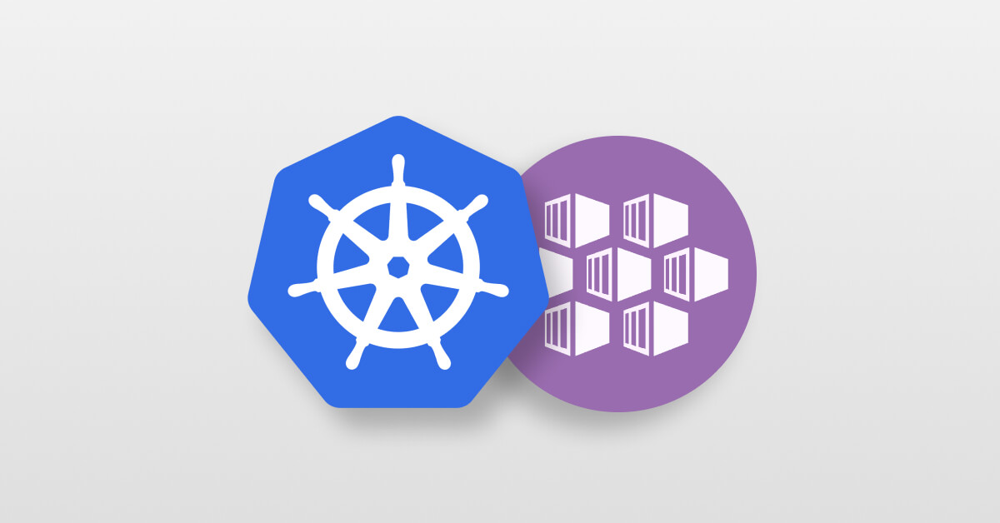

<!-- Improved compatibility of back to top link: See: https://github.com/othneildrew/Best-README-Template/pull/73 -->

<!--
*** Thanks for checking out the Best-README-Template. If you have a suggestion
*** that would make this better, please fork the repo and create a pull request
*** or simply open an issue with the tag "enhancement".
*** Don't forget to give the project a star!
*** Thanks again! Now go create something AMAZING! :D
-->

<!-- PROJECT LOGO -->
 

  

<h3 align="center">Telia Cygate</h3>

  

    A short and simple introduction to use AKS in Azure.
     
     
    <a href="https://github.com/BoostSebastian/Lab_001_AKS">View Demo</a>
    ·
    <a href="https://github.com/BoostSebastian/Lab_001_AKS/issues">Report Bug</a>
    ·
    <a href="https://github.com/BoostSebastian/Lab_001_AKS/issues">Request Feature</a>
  

<!-- TABLE OF CONTENTS -->

  
Table of Contents

  <ol>
    <li>About The Lab</li>
    <li>Getting Started<ul>
        <li>Prerequisites</li>
        <li>Installation</li>
      </ul>
    </li>
    <li>Set Up DevOps Project</li>

  </ol>

<!-- ABOUT THE PROJECT -->
## About The Lab

 

 
 

<a href="https://azure.microsoft.com/en-us/services/kubernetes-service/">Azure Kubernetes Service (AKS)</a> is the quickest way to use Kubernetes on Azure. Azure Kubernetes Service (AKS) manages your hosted Kubernetes environment, making it quick and easy to deploy and manage containerized applications without container orchestration expertise. It also eliminates the burden of ongoing operations and maintenance by provisioning, upgrading, and scaling resources on demand, without taking your applications offline. Azure DevOps helps in creating Docker images for faster deployments and reliability using the continuous build option.

One of the biggest advantage to use AKS is that instead of creating resources in cloud you can create resources and infrastructure inside Azure Kubernetes Cluster through Deployments and Services manifest files.

This lab uses a Dockerized ASP.NET Core web application - MyHealthClinic (MHC) and is deployed to a Kubernetes cluster running on Azure Kubernetes Service (AKS) using Azure DevOps.

    There is a mhc-aks.yaml manifest file which consists of definitions to spin up Deployments and Services such as Load Balancer in the front and Redis Cache in the backend. The MHC application will be running in the mhc-front pod along with the Load Balancer.

The following image will walk you through all the steps explained in this lab

 

(<a href="#readme-top">back to top</a>)

<!-- GETTING STARTED -->
## Getting Started

The following tasks will be performed:

- Create an Azure Container Registry (ACR), AKS and Azure SQL server
- Provision the Azure DevOps Team Project with a .NET Core application using the Azure DevOps Demo Generator tool.
- Configure application and database deployment, using Continuous Deployment (CD) in the Azure DevOps
- Initiate the build to automatically deploy the application

## Prerequisites

  - Microsoft Azure Account: You will need a `valid and active Azure account` for the Azure labs. If you do not have one, you can sign up for a free trial.
  - You will need an `Azure DevOps account`. If you do not have one, you can sign up for free <a href="https://azure.microsoft.com/en-us/services/devops/">here</a>.

(<a href="#readme-top">back to top</a>)

